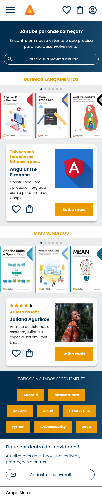

<h1 align="center">Projeto 3: AluraBook</h1>

## :memo: Sobre o Projeto
Projeto do Curso de HTML/CSS da Alura, sendo esse a parte 6/6 da formação <strong>A partir do zero: HTML e CSS para projetos web</strong>

O projeto foi realizado apos o [Projeto 2: AluraPlus](https://github.com/drpedronakata/Projeto2_AluraPlus_HTML-CSS).

## :wrench: Ferramentas utilizadas:
* HTML

* CSS

* [SwiperJS](https://swiperjs.com/)

## :notebook_with_decorative_cover: Certificados
* HTML e CSS: responsividade com mobile-first (12h)

## :bust_in_silhouette: Criador
<table>
  <tr>
    <td align="center">
      <a href="https://github.com/drpedronakata">
         
        
          <b>drpedronakata</b>
        
      </a>
    </td>
  </tr>
</table>

## :books: Links dos materiais

* [Curso de HTML e CSS: responsividade com mobile-first](https://cursos.alura.com.br/course/html-css-responsividade-mobile-first)

* [Github do Curso](https://github.com/alura-cursos/alurabooks)

* [Figma do Projeto](https://www.figma.com/file/sSMbIqKaGBd66Y8roxTk2p/AluraBooks?node-id=37-94&t=287VOk5JQI2SQ3OL-0)

* [Readme Template](https://github.com/tatialveso/readme-template/blob/main/README.md)

* [Lista de Emojis para Github markdown](https://gist.github.com/rxaviers/7360908)
